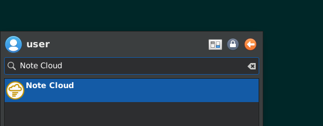
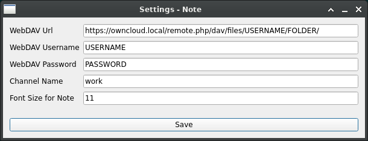
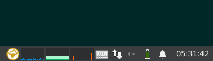
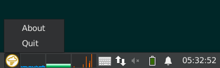
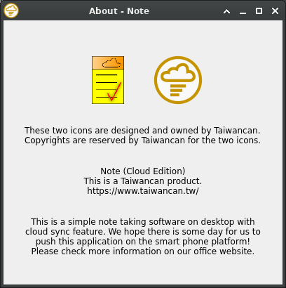
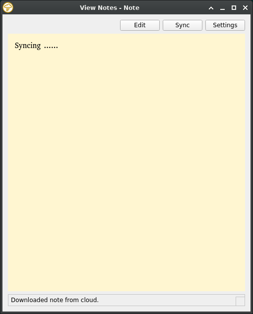
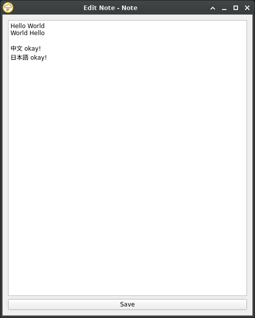
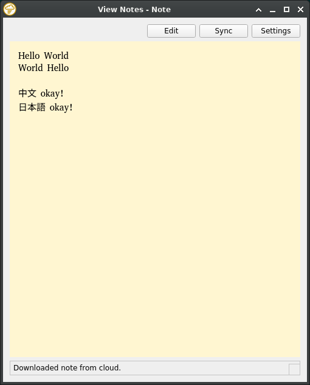
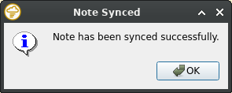
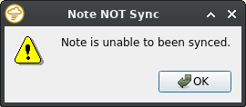

# What's this
This is a note taking application for desktop platform based on Qt framework.

# Specification
- This is a simple note taking app by typing with no other redundant functions.
- Your note is kept on a [owncloud-based server](https://owncloud.com/), which is able to be built and controlled by yourself.
- Although this version works, this application is still under development fo better UI/UX.
- This application is based on [Qt framework](https://www.qt.io/), a cross platform GUI framework, and you can try to deploy it on other platform.
- The developer is so lazy that he only tests this application on [Ubuntu 22.04](https://ubuntu.com/) with [Xfce DE](https://www.xfce.org/).

# Software pre-requirements
- OS with GUI
- Qt runtime environment (Due to copyright issues, this app is NOT a static linking build.)
- Codes from this repository.
- Owncloud-based server for cloud storage (with an user access and file create and edit permissions).

# Install and Setup
Installation is not required for this app.
However, some setup and configuration is required.

## Setup
Please run the following setup script in the shell on your computer, and change the script as your needs.
```bash
cd ~/note_cloud/
git clone https://github.com/haward79/note_cloud

# Open Qt Creator and open this repository as a project.
# Edit the source code to fit your needs.
# Build and Run the app to make sure everything works fine.

# If the icon/image files are missing during running,
# please copy them from "src/" to runtime directory.
# Simple example:
cp ~/note_cloud/note_cloud/src/*.png ~/note_cloud/build-note_cloud-Desktop_Qt_6_6_1_GCC_64bit-Debug/

# Try to run the app from terminal.
~/note_cloud/build-note_cloud-Desktop_Qt_6_6_1_GCC_64bit-Debug/note_cloud
```

## Add to application menu
Please run the following script to add a shortcut in the application menu.
You can also enable start on boot/login configuration in your DE setting manager.
```bash
mkdir ~/note_cloud/stable/
cp ~/note_cloud/note_cloud/src/*.png ~/note_cloud/stable/
cp ~/note_cloud/build-note_cloud-Desktop_Qt_6_6_1_GCC_64bit-Debug/note_cloud ~/note_cloud/stable/

cat > ~/.local/share/applications/note_cloud.desktop <<EOF
[Desktop Entry]
Name=Note Cloud
Type=Application
Exec=bash -c 'cd ~/note_cloud/stable/; ./note_cloud'
Icon=~/note_cloud/stable/icon.png
EOF
```

# Usage
Search for "Note" or "Note Cloud" in the application menu and run it!



For the first start, please fill in the settings for owncloud-based storage server (the first 3 fields).
You can set different channel name for different user or purpose in the same account on the same server without worrying about data conflict.
If you mess up the settings at this time, you can still change it later.



After initialized the settings, a icon for note will show in the system tray (the first yellow icon).



Doing a right-click on the icon, a small menu is shown.
Click `Quit` to close and terminate the whole app.
Click `About` to view more information about this app.



Check something important in the About.



Doing a left-click on the icon, the main window is shown.


Here is the main window.
It's simple, right?
Click `Edit` to edit your note. The edited note will be uploaded to the cloud immediately.
Click `Sync` to force a immediate note sync from cloud to local computer.
Click `Settings` to change the settings for storage server and UI.
In the middle and yellow area, your note is placed here.
In the bottom, it's a status bar.



Are you keep seeing the word "Syncing ......" in the note area?
To initialize your note, please click `edit` first.
Then, type something interesting text in the pop-ip window.
Don't forget to click Save to upload your new note to the cloud storage.



Go back to the main window and check if the note is changed.



You can edit your note at different computers.
The new content after edit is uploaded to the storage server immediately.
The notes are synced (downloaed) from the storage server to the computers every minute automatically.
To do a sync manually on the computer, you can click `Sync` in the main window.




# Changelog
- 12 / 12 2023
  - First upload.

# Copyright
This program is first written by [haward79](https://www.haward79.tw/) in [Taiwancan](https://www.taiwancan.tw/).

**This is a COPYLEFT program for the source code!**
**However, the icons and images are NOT copyleft resources.**
